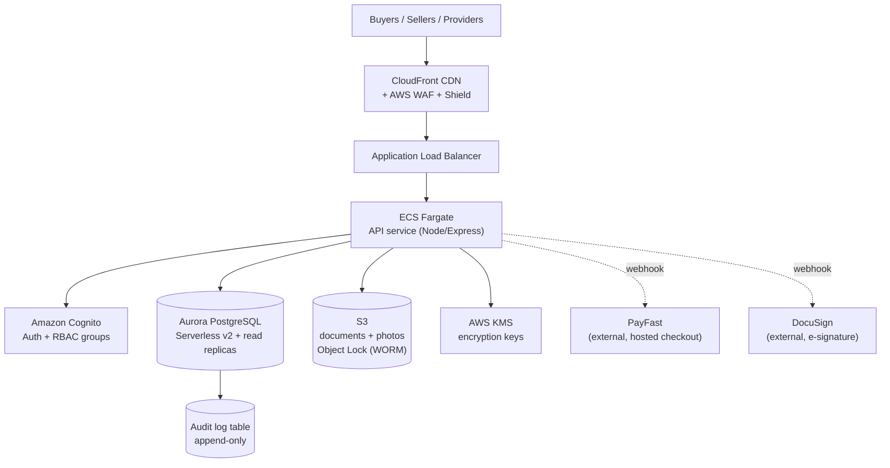

# SellSmart Property — Unified Infrastructure Architecture (No-Migration Plan)

> Supersedes the Supabase-first approach in `docs/BACKEND-STACK-RECOMMENDATION.md` for
> the long-term platform. That doc's third-party defaults (PayFast, DocuSign) and
> `docs/Infrastructure-Hosting-Plan.md`'s growth stages, data-security controls, and
> sequencing all still hold — this document replaces only *which infrastructure* fills
> those stages, so that going from Stage 0 to Stage 3 is a matter of turning up
> capacity, never moving data between systems or providers.

---

## 1. The constraint this plan is built around

You do not want a scaling event to become a migration event. Two backend options were
compared against that requirement:

| | Supabase (managed) | Native AWS managed services |
|---|---|---|
| No `af-south-1` region | ✅ blocks it — nearest region is EU | Not an issue — all 153 AWS services run in `af-south-1` |
| Managed sharding / multi-region writes past ~16 cores | ✅ blocks it — would force a re-platform at Stage 3 | Aurora PostgreSQL scales the same cluster from 0.5 ACU to 256 ACU, plus up to 15 read replicas, without changing engines or moving data |
| Same service, Stage 0 → Stage 3 | No — Stage 2+ requires migrating to something else | Yes — every stage below runs on the same Cognito pool, the same Aurora cluster, the same S3 buckets |

**Decision: build on native AWS managed services in `af-south-1` from day one.**
It costs more engineering time up front than Supabase (there's no auto-generated
REST API or bundled auth UI — we write the API layer), but every one of those
services is designed to scale in place. A "stage transition" becomes: raise the
Aurora ACU ceiling, add a read replica, add ECS tasks, extend an S3 lifecycle
policy. None of it touches existing rows or files.

---

## 2. Architecture — identical shape at every stage

- **Compute** — ECS Fargate running the API (Node/Express or Next.js API routes,
  containerized). Same deployment shape at every stage; scaling is task count and
  task size, set via Terraform variables.
- **Database** — Aurora PostgreSQL Serverless v2, I/O-Optimized. Scales 0.5–256 ACU
  continuously on the *same* cluster; add read replicas (up to 15) as read load
  grows. Row-Level Security enforces per-role, per-transaction access (Seller /
  Buyer / Provider / Admin, per `MVP-SPEC.md` §2), same policies from Stage 0 on.
- **Auth** — Amazon Cognito User Pools. Scales natively to millions of users, no
  re-platform. Roles map to Cognito groups; a pre-token-generation Lambda injects
  custom claims consumed by Postgres RLS. MFA enforced for Admin/Provider roles
  per `docs/Infrastructure-Hosting-Plan.md` §4.
- **Documents & photos** — S3, versioned, encrypted with KMS, Object Lock
  (governance mode) on signed OTPs and title documents for the 5-year FICA
  retention requirement. Lifecycle rules move cold data to Glacier at Stage 2+ —
  a policy change, not a migration.
- **CDN / perimeter** — CloudFront + AWS WAF + Shield Standard (free) from day
  one; Shield Advanced is an optional add at Stage 3 if traffic profile warrants it.
- **Audit trail** — append-only Postgres table in the same Aurora cluster, plus
  AWS CloudTrail for infrastructure-level events. Same schema at every stage.
- **Payments / e-signature** — PayFast and DocuSign, called from the API layer,
  webhooks land on the same ALB routes at every stage. Never self-hosted (keeps
  SellSmart out of PCI-DSS scope, per the hosting plan §1).
- **Infrastructure as Code** — Terraform (or AWS CDK) from day one. A "stage
  transition" is a reviewed PR changing a handful of variables (ACU ceiling,
  replica count, task count/size) — not a redesign.

---

## 3. Cost by stage (ZAR, planning estimates)

Assumes **R18.50 / USD** (August 2026) and Aurora **I/O-Optimized** pricing
(predictable billing — no per-request I/O surprise given audit-log write volume).
These are directional estimates for a finance conversation, not a quote — run the
final numbers through the AWS Pricing Calculator for `af-south-1` before budgeting.

| Component | Stage 0 — Pilot (≤1k users) | Stage 1 — Launch (1k–10k) | Stage 2 — Growth (10k–100k) | Stage 3 — Scale (100k+) |
|---|---|---|---|---|
| Aurora PostgreSQL (Serverless v2 + replicas) | ~$85/mo | ~$340/mo | ~$2,350/mo | ~$8,000–20,000/mo |
| ECS Fargate (API compute) | ~$15/mo | ~$100/mo | ~$800/mo | ~$3,000–8,000/mo |
| Application Load Balancer | included/minimal | ~$50/mo | ~$100/mo | ~$300/mo |
| Cognito (auth) | free (<10k MAU) | free (<10k MAU) | ~$500–1,350/mo | ~$1,500–4,000/mo |
| S3 (documents + photos) | free (<20GB) | ~$15/mo | ~$290/mo | ~$1,500–3,000/mo |
| CloudFront (CDN) | free (<1TB) | ~$0–50/mo | ~$150–500/mo | ~$1,000–3,000/mo |
| WAF + Shield Standard | ~$10/mo | ~$20/mo | ~$80/mo | ~$150/mo |
| KMS + CloudTrail | ~$5/mo | ~$15/mo | ~$50/mo | ~$300/mo |
| **Monthly total (USD)** | **~$120–140** | **~$540–600** | **~$4,300–5,500** | **~$15,500–38,500** |
| **Monthly total (ZAR)** | **~R2,200–2,600** | **~R10,000–11,100** | **~R79,500–101,700** | **~R287,000–712,000** |

Notes for the finance conversation:

- **No line item ever disappears or gets replaced** going down this table — costs
  scale up on the same services. There is no "re-platform" budget line to plan for.
- Stage 2→3 has the widest range because it's usage-scaled (traffic patterns,
  document volume, concurrent signings) — treat the Stage 3 figure as a planning
  ceiling, refined once Stage 2 traffic data exists.
- Shield Advanced (DDoS, ~$3,000/mo flat) is **not** included above — it's an
  optional Stage 3 add, only justified if the traffic/attack profile needs it.
- Reserved capacity / Compute Savings Plans typically cut Fargate and Aurora
  provisioned costs 20–40% once usage is predictable (Stage 2+) — not modeled
  above, worth revisiting with finance once there's 3+ months of real usage data.

---

## 4. Trade-off vs. the Supabase path (for the record)

Native AWS costs more build time up front: Supabase would have shipped auth,
storage policies, and a REST API in days; here we build a thin API layer
ourselves against Cognito/Aurora/S3 directly. Rough estimate: **2–4 additional
engineering weeks** for the foundation epic (auth wiring, RLS policy design,
signed-URL document handling, Terraform modules) versus the Supabase path.

That cost buys the thing this document was asked to solve: **zero forced
migrations** as the user base grows, and in-country (`af-south-1`) hosting from
day one, matching `docs/Infrastructure-Hosting-Plan.md`'s stated preference
without a Stage 2 re-platform.

---

## 5. What this changes in the feature-branch backlog

The foundation epic changes from "wire up Supabase client" to a slightly larger
scope, still a single feature branch off `development`:

1. **`feature/infra-foundation`** — Terraform for Stage 0 (Aurora Serverless v2
   min-capacity cluster, S3 buckets with Object Lock, Cognito user pool + groups,
   ECS Fargate service + ALB, CloudFront + WAF), CI/CD extended to build/push a
   Docker image and deploy on merge to `main`.
2. **`feature/auth-rbac`** — Cognito integration, JWT verification middleware,
   Postgres RLS policies per role.
3. From there, the epic list from the earlier plan (listings/search, enquiries &
   viewings, OTP & offers, documents, payments, e-signature, marketplace/
   conveyancer handoff, admin panel, notifications, compliance hardening) is
   unchanged in scope — only the data layer underneath each one is Aurora/S3/
   Cognito instead of Supabase.
